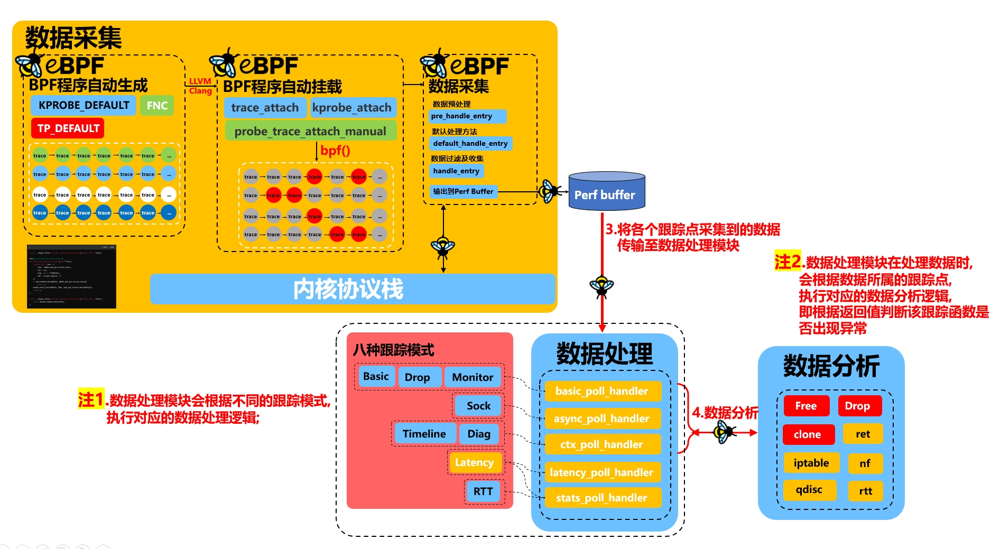

# Nettrace整体流程介绍

nettrace工具在编译成功后，会生成nettrace可执行文件，当我们通过传参使用该工具时，会经历以下4个阶段，分别是准备阶段、数据采集阶段、数据处理阶段、数据分析阶段。

初步介绍一下nettrace整体流程：

* 当用户通过参数控制启用nettrace某一功能后（开启某模式）后，首先会进入准备阶段，该阶段会构建trace tree、通过解析参数设置跟踪模式、根据确定的跟踪模式启用对应的跟踪点（这里涉及到了==BPF程序自动挂载技术==）；
* 当确定了启用哪些跟踪点后，将会进入到内核数据采集阶段，在该阶段，会根据启用跟踪点自动生成的BPF程序来对内核数据进行过滤与采集（这里涉及到==BPF程序自动生成技术==），并将采集到的数据传输到Perfbuffer中，等待用户态数据处理模块对其进行处理；
* 在数据采集阶段采集到内核数据并传输至Perfbuffer中后，将会根据对应的跟踪模式触发对应的数据处理模块，将收到的数据进行数据处理与输出；
* 对于大部分的跟踪点，都定义了所对应的数据分析器，如果需要，会进入数据分析器进行数据分析；


## 1.数据采集流程梳理

### 1.1 参数控制->准备阶段

用户在通过字符串界面输入传参后, 会执行以下步骤：


* 1.首先会进入准备阶段,该阶段会根据构建跟踪点组也即图中的trace树;


* 2.在将nettrace项目所涉及到的所有跟踪点构建成树后,会将用户的传参进行解析,来确定跟踪模式(该项目提供了八种跟踪模式,不同的跟踪模式所使用到的跟踪点以及数据处理方式均不相同)；


* 3.在确定了跟踪模式后会根据跟踪模式在trace树中启用相关的跟踪点；

	


### 1.2 准备阶段->数据采集

经过准备阶段将trace树、跟踪模式、要启用的跟踪点设置完毕后；将进行数据采集阶段，在数据采集部分，会根据跟踪模式及挂载的跟踪点，进行数据收集和数据过滤，并将数据传输至perfbuffer处；


* **1.BPF程序自动生成**：对于传统的ebpf程序，会对每个跟踪点定义其数据收集数据过滤逻辑；而nettrace则是通过定义了三个宏，分别是`KPROBE_DEFAULT`、`TP_DEFAULT`、`FNC`，分别对应默认的使用kprobe挂载的跟踪逻辑、默认使用tracepoint挂载的跟踪逻辑、以及自定义的跟踪逻辑，大部分跟踪点均使用默认的跟踪逻辑（也就是前两个宏定义的逻辑），极少数使用了FNC来自定义数据收集逻辑；我们将KPROBE_DEFAULT、TP_DEFAULT宏分别展开来探究两个默认数据采集的逻辑：

	* 默认tracepoint跟踪点将会执行以下数据采集逻辑,(仅以napi_gro_receive_entry跟踪点为例)

	```c
	static __always_inline int fake__napi_gro_receive_entry(context_info_t *info);
	
	SEC("tp_btf/napi_gro_receive_entry")
	int trace_napi_gro_receive_entry(void **ctx) {
	    context_info_t info = {
	        .func = INDEX_napi_gro_receive_entry,
	        .ctx = ctx,
	        .args = (void *)CONFIG(),
	        .skb = ctx_get_arg(ctx, 3)
	    };
	    if (pre_handle_entry(&info, INDEX_napi_gro_receive_entry))
	        return 0;
	    handle_entry_finish(&info, fake__napi_gro_receive_entry(&info));
	    return 0;
	}
	
	static __always_inline int fake__napi_gro_receive_entry(context_info_t *info) {
	    return default_handle_entry(info);
	}
	```

	* 默认kprobe相关跟踪点将会执行以下数据采集逻辑（仅以dev_gro_receive跟踪点为例）

	```c
	static __always_inline int fake__dev_gro_receive(context_info_t *info);
	
	SEC("kretprobe/dev_gro_receive")
	int trace_ret_dev_gro_receive(struct pt_regs *ctx)
	{
	    return handle_exit(ctx, INDEX_dev_gro_receive);
	}
	
	SEC("kprobe/dev_gro_receive")
	int trace_dev_gro_receive(struct pt_regs *ctx)
	{
	    context_info_t info = {
	        .func = INDEX_dev_gro_receive,
	        .ctx = ctx,
	        .args = (void *)CONFIG(),
	        .skb = nt_ternary_take(1, ctx_get_arg(ctx, 1), NULL),
	        .sk = nt_ternary_take(, ctx_get_arg(ctx, ), NULL)
	    };
	    if (pre_handle_entry(&info, INDEX_dev_gro_receive))
	        return 0;
	    handle_entry_finish(&info, fake__dev_gro_receive(&info));
	    return 0;
	}
	
	static __always_inline int fake__dev_gro_receive(context_info_t *info) {
	    return default_handle_entry(info);
	}
	```

* **2.BPF程序自动挂载**：我们在准备阶段已经根据不同的跟踪模式，启用了所需的跟踪点，其中打部分跟踪点均可自动挂载，而部分跟踪点则需要手动完成挂载工作；nettrace使用到ebpf提供的`trace_attach`、`kprobe_attach`进行自动挂载，使用自定义的`probe_trace_attach_manual`进行手动挂载操作；

	[Nettrace 自动挂载方式探究](./images/\Nettrace 自动挂载方式探究.md)

* **3.数据采集**：在将BPF程序挂载到指定跟踪点后，便开始进行数据采集工作了；当触发到我们挂载的跟踪点时，会执行相应跟踪点预设的数据过滤和数据采集逻辑（也即BPF程序自动生成中，我们通过三个宏定义的数据采集逻辑），通过`pre_handle_entry`进行数据预处理、在`default_handle_entry`->`handle_entry`中进行数据过滤与数据采集逻辑、并最终在`default_handle_entry`中将从内核中采集到的数据传输至Perfbuffer中，以供用户态数据处理逻辑进行对应的数据处理工作；用户态对数据的处理逻辑如下:




## 2. 数据处理流程梳理

数据处理阶段会根据不同跟踪模式定义不同的数据处理函数，接下来就是分析这些数据处理函数时如何进行数据处理和分析的;


我们以basic_poll_handler为例, 梳理该函数是如何处理TRACE_MODE_BASIC、TRACE_MODE_DROP、TRACE_MODE_MONITOR模式下采集到的的数据。

```c
/*TRACE_MODE_BASIC
 *TRACE_MODE_DROP
 *TRACE_MODE_MONITOR
 */
void basic_poll_handler(void *ctx, int cpu, void *data, u32 size)
{
	analy_entry_t entry = {
		.event = data,
		.cpu = cpu 
	};
	/*对采集到的单条数据 analy_entry_t 执行分析处理*/
	entry_basic_poll(&entry);
}
```

可以看出该函数先是初始化了`analy_entry_t`结构体，然后通过`entry_basic_poll(&entry)`进行数据分析处理.所以`entry_basic_poll(&entry)`是处理数据的核心函数,`analy_entry_t`是分析数据的核心结构体他存储着要分析的数据块的全部信息;


```c
/*对采集到的单条数据 analy_entry_t 执行分析处理*/
static inline void entry_basic_poll(analy_entry_t *entry)
{
	trace_t *trace;
	/*1.从 analy_entry_t 中获取 trace_t 信息*/
	trace = get_trace_from_analy_entry(entry);
	/*2.尝试运行与 trace 绑定的 entry 分析器*/
	try_run_entry(trace, trace->analyzer, entry);
	/*3.如果需要分析返回值，调用 exit 分析器*/
	if (trace_analyse_ret(trace)) {
		analy_exit_t analy_exit = {
			.event = {
				.val = entry->event->retval,
			},
			.entry = entry,
		};
		try_run_exit(trace, trace->analyzer, &analy_exit);
	}
	/*4.输出 entry 的分析结果*/
	analy_entry_output(entry, NULL);
}
```

`entry_basic_poll()`函数会先通过`get_trace_from_analy_entry()`找到数据块的源头trace_t的信息，即哪一个跟踪点产生了这个数据块；接着尝试使用trace对应的分析器的entry和exit函数去进行数据处理与分析（`try_run_entry()`,`try_run_exit()`），最后调用`analy_entry_output()`输出分析结果；

所以说实现数据分析的具体函数在分析器中定义着，需要进一步去查看分析器相关实现代码；

## 3. 数据分析器

在第二部分中，`entry_basic_poll()`函数是通过trace_t结构体找到分析器的entry和exit处理函数，先看一下trace_t结构体：

```c
typedef struct trace {
    // 内核函数或跟踪点的名称，最长 64 字符
    char name[64];
    // 对跟踪点的简要描述，例如用途或功能
    char *desc;
    // 关联的消息，用于日志记录或调试输出
    char *msg;
    // 绑定到该跟踪点的 eBPF 程序的名称
    char *prog;
    // 跟踪点的类型，例如函数跟踪（TRACE_FUNCTION）或 tracepoint（TRACE_TP）
    enum trace_type type;
    // 可选的条件，用于判断是否启用跟踪点
    char *cond;
    // 可选的正则表达式，用于匹配内核函数名称
    char *regex;
    // 如果是 tracepoint 类型，记录 tracepoint 的名称
    char *tp;
    // 函数参数列表中 skb（socket buffer）的索引，从 1 开始，0 表示没有 skb
    u8 skb;
    // 在 ftrace 事件中 skb 的偏移量
    u8 skboffset;
    // 函数参数列表中 socket 的索引，与 skb 类似
    u8 sk;
    // 在 ftrace 事件中 socket 的偏移量
    u8 skoffset;
    // 全局链表，包含所有的 trace_t 实例
    struct list_head all;
    // 属于同一组的链表，管理 trace 分组
    struct list_head list;
    // 与该跟踪点关联的规则链表，例如匹配条件或阈值
    struct list_head rules;
    // 指向备份 trace 的指针，用于冗余或备用
    struct trace *backup;
    // 标记该 trace 是否为备份点
    bool is_backup;
    // 标志是否为探针模式（通常用于调试）
    bool probe;
    // 标志是否默认启用此跟踪点
    bool def;
    // 标志 eBPF 程序是否为自定义的
    bool custom;
    // 监控模式的标志，定义该 trace 的监控模式
    int monitor;
    // 唯一索引，用于标识此 trace
    int index;
    // 被跟踪函数的参数数量
    int arg_count;
    // 跟踪点的状态，例如加载、启用或无效等标志位
    u32 status;
    // 指向父组的指针，表示此 trace 的分组归属
    trace_group_t *parent;
    // 指向分析器模块的指针，用于关联分析逻辑
    struct analyzer *analyzer;
} trace_t;

```

这个结构体中的最后一个字段是`analyzer`也就是当前跟踪点对应的分析器，`entry_basic_poll()`就是通过这个分析器中的函数进行数据分析的；


### 3.1 trace_t与分析器的关系

不同的跟踪点根据`trace.yaml`配置文件定义了该跟踪点是否需要分析器以及用哪个分析器；`trace.yaml`文件会通过`gen_trace.py`文件生成`trace_group.c`以及`kprobe_trace.h`文件。在所生成的`trace_group.c`文件中，定义了每个跟踪点的trace_t结构体，我们拿`trace_tcp_ack_update_rtt`挂载点为例进行介绍：

```c
trace_t trace_tcp_ack_update_rtt = {
	.desc = "",
	.type = TRACE_FUNCTION,
    /*分析器*/
	.analyzer = &ANALYZER(rtt),
	.is_backup = false,
	.probe = false,
	.name = "tcp_ack_update_rtt",
	.sk = 1,
	.custom = true,
	.def = true,
	.index = INDEX_tcp_ack_update_rtt,
	.prog = "__trace_tcp_ack_update_rtt",
	.parent = &group_tcp_state,
	.rules = LIST_HEAD_INIT(trace_tcp_ack_update_rtt.rules),
};
```

可以看到该跟踪点的分析器指向了某个地址`&ANALYZER(rtt)`，该地址做进一步的探索：

在analysis.h文件中有对`ANALYZER`的宏定义：

```c
#define ANALYZER(name) analyzer_##name
```

将宏`ANALYZER(rtt)`展开后便是：`.analyzer = &analyzer_rtt,`analyzer_rtt是什么？它对应的地址有什么？后面我们会涉及；

### 3.2 分析器的定义

在`analysis.c`文件中定义了八个不同的分析器，我们以rtt为例进行介绍；

```c
DEFINE_ANALYZER_ENTRY(rtt, TRACE_MODE_ALL_MASK)
{
	/*1.通过define_pure_event提取rtt事件数据*/
	define_pure_event(rtt_event_t, event, e->event);
	char *msg = malloc(1024);

	msg[0] = '\0';
	/*2.将first_rtt和last_rtt格式化成字符串，用于输出和日志记录*/
	sprintf(msg, PFMT_EMPH_STR(" *rtt:%ums, rtt_min:%ums*"),
		event->first_rtt, event->last_rtt);
	/*3.entry_set_msg将聚合后的消息绑定到当前分析条目analy_entry_t*/
	entry_set_msg(e, msg);

	return RESULT_CONT;
}
DEFINE_ANALYZER_EXIT_FUNC_DEFAULT(rtt)
```

上面这段代码是对rtt分析器的定义，我们进一步了解一下`DEFINE_ANALYZER_ENTRY(rtt, TRACE_MODE_ALL_MASK)`和`DEFINE_ANALYZER_EXIT_FUNC_DEFAULT(rtt)`是什么，展开后是什么样的；

在`analysis.h`文件中包含着与分析器相关的宏定义：

```c
#define ANALYZER(name) analyzer_##name

#define DEFINE_ANALYZER_PART(name, type, mode_mask)			\
	analyzer_result_t analyzer_##name##_exit(trace_t *trace,	\
		analy_exit_t *e) __attribute__((weak));			\
	analyzer_result_t analyzer_##name##_entry(trace_t *trace,	\
		analy_entry_t *e) __attribute__((weak));		\
	analyzer_t ANALYZER(name) = {					\
		.analy_entry = analyzer_##name##_entry,			\
		.analy_exit = analyzer_##name##_exit,			\
		.mode = mode_mask,					\
	};								\
	analyzer_result_t analyzer_##name##_##type(trace_t *trace,	\
		analy_##type##_t *e)

#define DEFINE_ANALYZER_ENTRY(name, mode)				\
	DEFINE_ANALYZER_PART(name, entry, mode)

#define DEFINE_ANALYZER_EXIT(name, mode)				\
	DEFINE_ANALYZER_PART(name, exit, mode)

#define DEFINE_ANALYZER_EXIT_FUNC(name)					\
	analyzer_result_t analyzer_##name##_exit(trace_t *trace,	\
		analy_exit_t *e)

#define DEFINE_ANALYZER_EXIT_FUNC_DEFAULT(name)				\
DEFINE_ANALYZER_EXIT_FUNC(name)						\
{									\
	rule_run_ret(e->entry, trace, e->event.val);			\
	return RESULT_CONT;						\
}

#define DECLARE_ANALYZER(name) extern analyzer_t ANALYZER(name)
#define IS_ANALYZER(target, name) (target == &(ANALYZER(name)))
```

我们以rtt为例，将分析器的定义进行宏展开：

```c
analyzer_result_t analyzer_rtt_exit(trace_t *trace, analy_exit_t *e) __attribute__((weak));
analyzer_result_t analyzer_rtt_entry(trace_t *trace, analy_entry_t *e) __attribute__((weak));
/*analyzer_rtt结构体，trace_t中的.analyzer指向的就是这个结构体*/
analyzer_t analyzer_rtt = {
    .analy_entry = analyzer_rtt_entry,
    .analy_exit = analyzer_rtt_exit,
    .mode = TRACE_MODE_ALL_MASK,
};

analyzer_result_t analyzer_rtt_entry(trace_t *trace, analy_entry_t *e)
{
	/*1.通过define_pure_event提取rtt事件数据*/
	define_pure_event(rtt_event_t, event, e->event);
	char *msg = malloc(1024);

	msg[0] = '\0';
	/*2.将first_rtt和last_rtt格式化成字符串，用于输出和日志记录*/
	sprintf(msg, PFMT_EMPH_STR(" *rtt:%ums, rtt_min:%ums*"),
		event->first_rtt, event->last_rtt);
	/*3.entry_set_msg将聚合后的消息绑定到当前分析条目analy_entry_t*/
	entry_set_msg(e, msg);

	return RESULT_CONT;
}

analyzer_result_t analyzer_rtt_exit(trace_t *trace, analy_exit_t *e)
{
    rule_run_ret(e->entry, trace, e->event.val);
    return RESULT_CONT;
}
```

2.3.1小节中所提的两个问题：analyzer_rtt是什么？它对应的地址有什么？便得到了解答：

- analyzer_rtt是我们在定义分析器时，描述该分析器rtt的结构体地址，该结构体中包含着当前分析器的entry数据分析函数和exit数据分析函数；


### 3.3 数据处理->数据分析

在第二部分中，我们知道了数据在采集到之后是如何进行数据处理的，也知道在对应的数据处理函数中是如何找到器对应跟踪点所使用的分析器的。在本章中我们了解到分析器时如何定义与实现的，`try_run_entry()`函数通过调用提前定义好的`analyzer_rtt_entry`和`analyzer_rtt_exit`函数，进行真正的数据分析与处理；


## 4.七层的数据采集实现细节

前面我们以及梳理了nettrace中数据是如何采集的,下面将围绕各个跟踪点在内核中进行数据采集的逻辑进行梳理,其实最终就是探究`KPROBE_DEFAULT`、`TP_DEFAULT`、`FNC`三者的具体实现逻辑;

在前面我们已经介绍了`KPROBE_DEFAULT`、`TP_DEFAULT`两个宏展开后具体的逻辑,这里再展示一下:

* `TP_DEFAULT`:默认tracepoint跟踪点将会执行以下数据采集逻辑,(仅以napi_gro_receive_entry跟踪点为例)

```c
static __always_inline int fake__napi_gro_receive_entry(context_info_t *info);

SEC("tp_btf/napi_gro_receive_entry")
int trace_napi_gro_receive_entry(void **ctx) {
    context_info_t info = {
        .func = INDEX_napi_gro_receive_entry,
        .ctx = ctx,
        .args = (void *)CONFIG(),
        .skb = ctx_get_arg(ctx, 3)
    };
    if (pre_handle_entry(&info, INDEX_napi_gro_receive_entry))
        return 0;
    handle_entry_finish(&info, fake__napi_gro_receive_entry(&info));
    return 0;
}

static __always_inline int fake__napi_gro_receive_entry(context_info_t *info) {
    return default_handle_entry(info);
}
```

- `KPROBE_DEFAULT`: 默认kprobe相关跟踪点将会执行以下数据采集逻辑（仅以dev_gro_receive跟踪点为例）

```c
static __always_inline int fake__dev_gro_receive(context_info_t *info);

SEC("kretprobe/dev_gro_receive")
int trace_ret_dev_gro_receive(struct pt_regs *ctx)
{
    return handle_exit(ctx, INDEX_dev_gro_receive);
}

SEC("kprobe/dev_gro_receive")
int trace_dev_gro_receive(struct pt_regs *ctx)
{
    context_info_t info = {
        .func = INDEX_dev_gro_receive,
        .ctx = ctx,
        .args = (void *)CONFIG(),
        .skb = nt_ternary_take(1, ctx_get_arg(ctx, 1), NULL),
        .sk = nt_ternary_take(, ctx_get_arg(ctx, ), NULL)
    };
    if (pre_handle_entry(&info, INDEX_dev_gro_receive))
        return 0;
    handle_entry_finish(&info, fake__dev_gro_receive(&info));
    return 0;
}

static __always_inline int fake__dev_gro_receive(context_info_t *info) {
    return default_handle_entry(info);
}
```

### 4.1 Link层数据采集:

在 `nettrace` 进行 网络包延迟分析 时，需要关注数据链路层（L2）的多个模块。这些模块涉及数据包的 接收（Link-In）、调度（Scheduler）、转发（Bridge, VXLAN, OVS）、队列管理（Bonding, VLAN）、用户态抓包（PF_PACKET），所有这些组件都可能影响数据包的最终端到端延迟（E2E Latency）。

在 L2 层，网络包的 延迟来源 主要包括：

* **数据包的接收处理（Link-In）**

* **数据包的发送处理（Link-Out）**

* **数据包在网络设备队列中的调度（Scheduler）**

* **数据包在不同网络组件（Bridge, VXLAN, OVS, VLAN）间的转发**

* **用户态应用直接访问数据包的影响（PF_PACKET）**

所以会对这些模块进行数据采集。

#### 4.1.1 Link-in 数据包的接收处理

该模块关注**数据包从物理网卡（NIC）进入内核协议栈**，其中涉及到了以下跟踪点，当这些跟踪点被触发时，会执行`KPROBE_DEFAULT`或`TP_DEFAULT`或`FNC`中定义的数据采集逻辑；该模块中数据采集逻辑均为默认采集逻辑；不过多赘述；

| 挂载点                       | 意义                                      | 分析建议                    | 类型   |
| ---------------------------- | ----------------------------------------- | --------------------------- | ------ |
| `net/napi_gro_receive_entry` | 捕获 GRO 模块接收到数据包                 | 优化接收路径                | TP     |
| `dev_gro_receive`            | 捕获数据包被 GRO 丢弃的时间点             | 检查 GRO 策略               | Kprobe |
| `enqueue_to_backlog`         | 捕获数据包入队到 CPU backlog 的失败时间点 | 增加 `netdev_max_backlog`   | Kprobe |
| `netif_receive_generic_xdp`  | 捕获 XDP 程序对数据包的处理时间点         | 检查 XDP 程序逻辑           | kprobe |
| `xdp_do_generic_redirect`    | 捕获 XDP 程序重定向失败的时间点           | 检查目标 `ifindex` 是否存在 | kprobe |
| `__netif_receive_skb_core`   | 捕获网络栈处理数据包的时间点              | 检查网络栈处理性能          | TP     |

#### 4.1.2 Link-Out 数据包的发送处理

数据包从内核协议栈进入网卡（NIC）队列，最终发送到物理链路；其中涉及到了以下跟踪点，当这些跟踪点被触发时，会执行`KPROBE_DEFAULT`或`TP_DEFAULT`或`FNC`中定义的数据采集逻辑；该模块中数据采集逻辑均为默认采集逻辑；不过多赘述；

| 挂载点                | 意义                                    | 分析建议         | 类型   |
| --------------------- | --------------------------------------- | ---------------- | ------ |
| `__dev_queue_xmit`    | 捕获数据包发送到队列失败的时间点        | 检查队列配置     | kprobe |
| `dev_hard_start_xmit` | 捕获数据包成功发送到网卡驱动NIC的时间点 | 检查驱动传输性能 | kprobe |


#### 4.1.3 Scheduler 数据包在网络设备队列中的调度时延

Scheduler（调度器）在网络协议栈中的作用是 控制数据包的发送顺序、速率和优先级，以实现 QoS（服务质量）、流量整形和拥塞控制。
在 `nettrace` 采集网络包延迟时，Scheduler 可能引入额外的排队、限速和流量调度延迟，因此需要 跟踪关键路径 以确定 流量控制对网络包的影响。

该模块对以下事件进行跟踪：

1. **数据包分类**：确定数据包属于哪个队列（`tcf_classify`、`cls_bpf_classify`）。
2. **流量控制动作**：应用 BPF 或 `tc` 规则（`tcf_bpf_act`）。
3. **数据包入队**：数据包进入 `Qdisc` 队列（`qdisc_enqueue`）。
4. **数据包出队**：数据包被调度出队，送往网卡（`qdisc_dequeue`）。

其中`tcf_classify`、`cls_bpf_classify`、`tcf_bpf_act` 数据采集逻辑均为默认采集逻辑；不过多赘述；

这里介绍一下`qdisc_enqueue`、`qdisc_dequeue`两个跟踪点的自定义的数据采集逻辑：

```c
#define DEFINE_ALL_PROBES(FN, FN_tp, FNC)
	...
	FNC(qdisc_dequeue)	\
	FNC(qdisc_enqueue)	\
	...
        
DEFINE_ALL_PROBES(KPROBE_DEFAULT, TP_DEFAULT, FNC)
```

**1.1.3.1 `qdisc_enqueue`**

我们看一下自定义的`qdisc_enqueue` 的数据采集逻辑:

```
DEFINE_TP(qdisc_enqueue, qdisc, qdisc_enqueue, 2, 24)
{
	struct Qdisc *q = *(struct Qdisc **)info_tp_args(info, 8, 0);
	return bpf_qdisc_handle(info, q);
}
```

将其展开：

```c
static __always_inline int fake__qdisc_enqueue(context_info_t *info);

SEC("tp/qdisc/qdisc_enqueue")
int TRACE_NAME(qdisc_enqueue)(void *ctx) {
	context_info_t info = {
		.func = INDEX_qdisc_enqueue,
		.ctx = ctx,
		.args = (void *)CONFIG(),
		.skb = *(void **)(ctx + 24)
	};
	if (pre_handle_entry(&info, INDEX_qdisc_enqueue))
		return 0;
	handle_entry_finish(&info, fake__qdisc_enqueue(&info));
	return 0;
}

static __always_inline int fake__qdisc_enqueue(context_info_t *info) {
	struct Qdisc *q = *(struct Qdisc **)info_tp_args(info, 8, 0);
	return bpf_qdisc_handle(info, q);
}
```

我们可以看到，该自定义ebpf程序的逻辑和默认的`TP_DEFAULT`逻辑基本一致

**1.1.3.2 qdisc_dequeue**

qdisc_dequeue同理：

```
static __always_inline int fake__qdisc_dequeue(context_info_t *info);

SEC("tp/qdisc/qdisc_dequeue")
int TRACE_NAME(qdisc_dequeue)(void *ctx) {
	context_info_t info = {
		.func = INDEX_qdisc_dequeue,
		.ctx = ctx,
		.args = (void *)CONFIG(),
		.skb = *(void **)(ctx + 32)
	};
	if (pre_handle_entry(&info, INDEX_qdisc_dequeue))
		return 0;
	handle_entry_finish(&info, fake__qdisc_dequeue(&info));
	return 0;
}

static __always_inline int fake__qdisc_dequeue(context_info_t *info) {
	struct Qdisc *q = *(struct Qdisc **)info_tp_args(info, 8, 0);
	return bpf_qdisc_handle(info, q);
}

```

## 5. 数据分析器实现细节：

每个跟踪点均会对应一个分析器，当该跟踪点产生数据并传输到perfbuffer后，便会触发数据处理器，并开启跟踪点对应的数据分析器进行数据分析，并将分析得到的结果输出；以下是一些数据分析器所涉及到的结构体：

**上下文 analy_entry_t**

```c
typedef struct {
    /* 用于链接属于同一上下文的多个事件 */
    struct list_head list;               // 双向链表节点，关联多个 analy_entry_t 结构体
    analy_ctx_t *ctx;                    // 指向当前事件所属的分析上下文
    fake_analy_ctx_t *fake_ctx;          // 指向伪造的分析上下文，用于特殊场景或中间态处理
    event_t *event;                      // 指向与此 analy_entry_t 相关的事件数据
    rule_t *rule;                        // 匹配的第一条规则（如果有）
    char *msg;                           // 日志消息，包含该事件分析的结果描述
    char *extinfo;                       // 扩展信息，用于记录更详细的上下文分析结果
    u64 priv;                            // 私有数据字段，供分析器内部使用
    u32 status;                          // 当前事件的状态标志（例如是否设置日志消息）
    u16 cpu;                             // 记录处理此事件的 CPU 编号（多核环境下）
    struct list_head cpu_list;           // 基于 kretprobe 程序使用的链表节点，用于 CPU 特定的事件组织
} analy_entry_t;
```

 **define_pure_event宏**

```c#
#define define_pure_event(type, name, data)			\
	pure_##type *name =					\
		(!trace_ctx.detail ? (void *)(data) +		\
			offsetof(type, __event_filed) :		\
			(void *)(data) +			\
			offsetof(detail_##type, __event_filed))
```

**事件宏定义(src/progs/shared.h)**

```c#
#define DEFINE_EVENT(name, fields...)		\
typedef struct {				\
	event_t event;				\
	int __event_filed[0];			\
	fields					\
} name;						\
typedef struct {				\
	detail_event_t event;			\
	int __event_filed[0];			\
	fields					\
} detail_##name;				\
typedef struct {				\
	fields					\
} pure_##name;
```

这个宏通过参数 `name` 和可变参数 `fields...` 来生成三种不同的事件结构类型：

1. 基础事件结构 `name`，包含基本事件头部和字段信息，适合一般的事件处理任务。
2. 详细事件结构 `detail_##name`，提供更多元数据，用于记录或调试场景。
3. 精简事件结构 `pure_##name`，仅关注事件的核心字段，适合性能敏感的应用场景。


