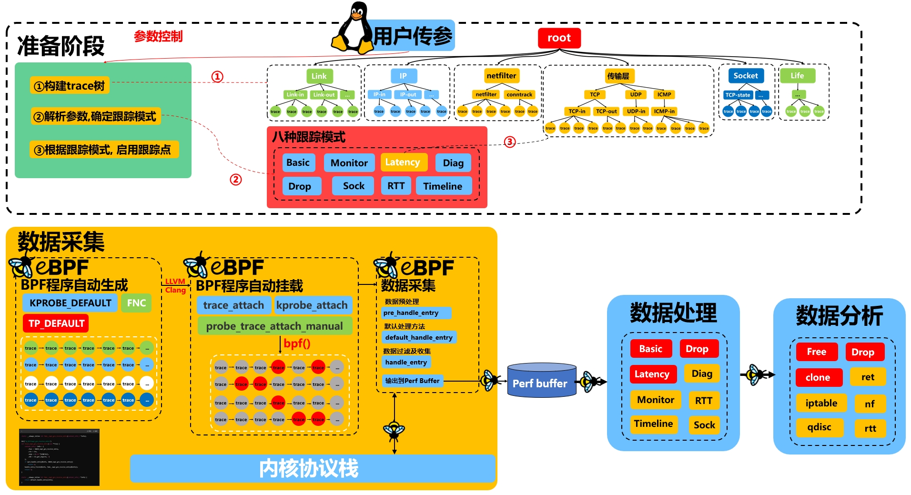
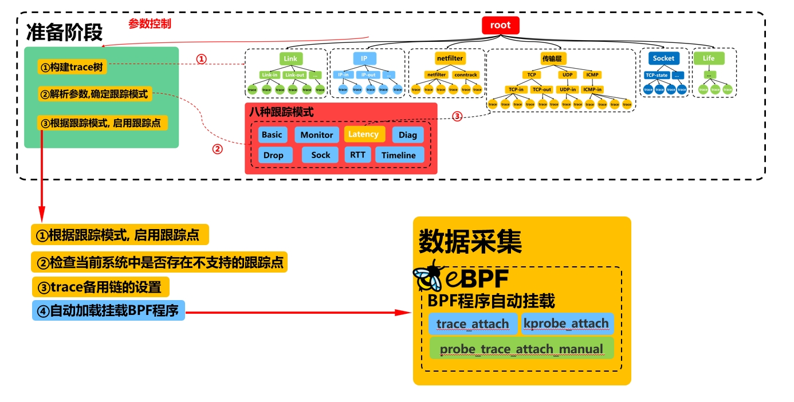
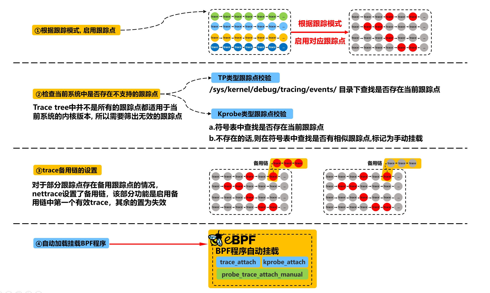
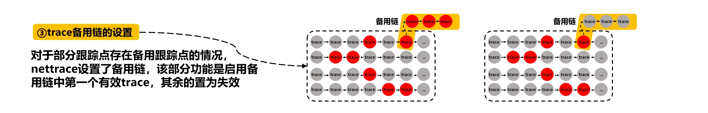

# Nettrace 自动挂载方式探究

在nettrace中，构建了一个跟踪点链表树，树中包含不同的跟踪组，每个跟踪组中包含实现当前功能的所有跟踪点，这是实现跟踪点自动挂载的基础。nettrace工具提供了不同模式的数据采集方法，会根据参数来判断当前处于何种跟踪模式，不同的跟踪模式通过不同的跟踪点实现数据采集。那么如何根据不同的跟踪模式，自动加载该跟踪模式下对应的挂载点是一个值得深入探讨的问题，这也是数据采集模块实现的重点。




## 1.跟踪组及跟踪链表的构建

在nettrace入口函数main()中，第一步便是构建跟踪点树

```c
int main(int argc, char *argv[])
{
	/*1.初始化跟踪组*/
	init_trace_group();
	...
}
```

该函数在`trace_group.c`中，接下来将介绍`trace_group.c`文件；

在项目编译过程中,会通过`gen_trace.py`脚本去解析`trace.yaml`文件,生成`trace_group.c`与`kprobe_trace.h`文件,前者定义了所有的挂载点以及跟踪点链表, 并组建成了跟踪点树, 后者对所有的挂载点定义了其索引; 

```shell
                               nettrace.c ----------------- nettrace
                                  trace.c                       |
                                    xxxxx                       |
                                                                |
                                                                |
                            trace_group.c                       |
                          ╱                                     |
trace.yaml -- gen_trace.py                                      |
                          ╲                                     |
                            kprobe_trace.h                      |
                                          ╲                     |
                                            kprobe.o → kprobe.skel.h
                                          ╱
                                  kprobe.c
```

在`trace_group.c`文件中依靠init_trace_group()函数初始化了跟踪组，将项目所涉及的所有跟踪点构建成树的形式；

`trace_group.c`文件中定义的跟踪组、跟踪点、跟踪链表以及对应的数据处理规则；

```c
trace_group_t group_link = {
	.name = "link",
	.desc = "link layer (L2) of the network stack",
	.children = LIST_HEAD_INIT(group_link.children),
	.traces = LIST_HEAD_INIT(group_link.traces),
	.list = LIST_HEAD_INIT(group_link.list),
};
trace_t trace_dev_gro_receive = {
	.desc = "",
	.type = TRACE_FUNCTION,
	.analyzer = &ANALYZER(default),
	.is_backup = false,
	.probe = false,
	.name = "dev_gro_receive",
	.skb = 2,
	.custom = false,
	.def = true,
	.index = INDEX_dev_gro_receive,
	.prog = "__trace_dev_gro_receive",
	.parent = &group_link_in,
	.rules = LIST_HEAD_INIT(trace_dev_gro_receive.rules),
};
trace_list_t trace_dev_gro_receive_list = {
	.trace = &trace_dev_gro_receive,
	.list = LIST_HEAD_INIT(trace_dev_gro_receive_list.list)
};
rule_t rule_trace_dev_gro_receive_0 = {	.level = RULE_ERROR,
	.expected = 4,c
	.type = RULE_RETURN_EQ,
	.msg = PFMT_ERROR"packet is dropped by GRO"PFMT_END,
};
```

`trace_group.c`文件中初始化跟踪树的函数；

```c
void init_trace_group()
{
	list_add_tail(&group_link.list, &root_group.children);
	list_add_tail(&group_link_in.list, &group_link.children);
	list_add_tail(&trace_napi_gro_receive_entry_list.list, &group_link_in.traces);
	all_traces[INDEX_napi_gro_receive_entry] = &trace_napi_gro_receive_entry;
	...
}
```

## 2.跟踪点自动挂载的实现

将跟踪点树构建完成后，需要根据不同的跟踪模式去挂载对应的跟踪点，nettrace的实现方式如下：



- 首先会在环境准备阶段，根据参数解析出用户设定的模式并将该模式作为跟踪模式；
- 其次会根据设定好的跟踪模式，去将该跟踪模式所对应的挂载点进行标记；
- 在将不同的跟踪模式对应的跟踪点进行标记后，会遍历跟踪树中所有的跟踪点，检查当前跟踪点在当前系统下是否无效（分为tp，kprobe两种），并将其初始化；
- 在对当前跟踪模式下所有有效跟踪点启用后，会查看这些有效跟踪点中是否存在冗余现象，即启用了两个功能相似的跟踪点；nettrace针对具有相同跟踪功能的跟踪点，设置了备用链，即一条备用链上的所有跟踪点都是功能相似的，类似于足球赛中的替补选手，仅启用备用链中第一个有效的跟踪点；
- 最后，会在加载附加bpf程序时，根据挂载点的状态，选择手动加载或自动加载（有的跟踪点需要手动加载）；



### 2.1 跟踪模式的设定与挂载点的绑定

#### 2.1.1 跟踪模式的确定

在`trace_prepare()->trace_prepare_args()`函数中，通过参数对跟踪模式进行设置，并标记该跟踪模式所对应的跟踪点；

```c
static int trace_prepare_args()
{
	...
	/*定义七种跟踪模式*/
#define ASSIGN_MODE(name, __mode) do {			\
	if (args->name)					\
		trace_ctx.mode = TRACE_MODE_##__mode;	\
} while (0)

	ASSIGN_MODE(basic, BASIC);
	ASSIGN_MODE(intel, DIAG);
	ASSIGN_MODE(sock, SOCK);
	ASSIGN_MODE(monitor, MONITOR);
	ASSIGN_MODE(drop, DROP);
	ASSIGN_MODE(rtt, RTT);
	ASSIGN_MODE(latency, LATENCY);
	...
    /*根据当前的跟踪模式，对相应的追踪点进行标记*/    
	trace_prepare_mode(args)      
    ...
}
	
```

#### 2.1.2 跟踪点的启用

在确定完跟踪模式后，将根据跟踪模式，在trace tree中启用对应跟踪点；


- 首先对于用户指定了特定的跟踪点的情况，将启用这些跟踪点；对于未指定跟踪点，且非drop、rtt跟踪模式的，则先启用全部默认跟踪点；

```c
/*跟踪模式、跟踪点的确定*/
static int trace_prepare_args()
{
    ...
	fix_trace = args->drop || args->rtt;
	/*如果还未指定跟踪点，且不是drop、rtt跟踪模式，则启用默认的140个跟踪点*/
	if (!traces) {
		if (!fix_trace)
			trace_enable_default();
	} else if (strcmp(traces, "?") == 0) {
		/*如果指定了traces，并且包含？，则展示所有跟踪点*/
		args->show_traces = true;
		traces = "all";
	} else {
		/*如果是drop或rtt模式*/
		if (fix_trace) {
			pr_err("can't specify traces in this mode!\n");
			goto err;
		}
		trace_parse_traces(traces, 1);
	}
    ...
    /*根据当前的跟踪模式，对相应的追踪点进行标记*/    
	trace_prepare_mode(args)
    ...
}
```

- 其次将根据指定的跟踪模式进行进一步的跟踪点调整，包括指定或取消特定的跟踪点，通过`trace_prepare_mode(args) ` 对该跟踪模式对应的挂载点进行标记

```c
/*根据当前的跟踪模式，对相应的追踪点进行标记*/
static int trace_prepare_mode(trace_args_t *args)
{	
	trace_t *trace;

	switch (trace_ctx.mode) {
	/*1. DIAG ：启用所有挂载点；
	 *   TIMELINE：为 skb_clone 挂载点启用返回值追踪；
	 */
	case TRACE_MODE_DIAG:
		trace_all_set_ret();
	case TRACE_MODE_TIMELINE:
		if (!trace_ctx.args.traces_noclone) {
			/* enable skb clone trace */
			trace_set_ret(&trace_skb_clone);
		}
		break;

	/*2. LATENCY模式：
	 *   将 skb_clone 挂载点标记为无效，
	 *   原因是当前为延迟模式（latency）
	 */
	case TRACE_MODE_LATENCY:
		trace_set_invalid_reason(&trace_skb_clone, "latency");
		break;
	case TRACE_MODE_DROP:
		if (!trace_ctx.drop_reason)
			pr_warn("skb drop reason is not support by your kernel"
				", drop reason will not be printed\n");
		if (args->drop_stack) {
			if (trace_set_stack(&trace_kfree_skb))
				goto err;
		}
		trace_set_enable(&trace_kfree_skb);
	/*3.BASIC SOCK
	 *  这两种模式下没有特定的挂载点设置
	 */
	case TRACE_MODE_BASIC:
	case TRACE_MODE_SOCK:
		break;
	/*4.MONITOR
	 *  如果挂载点未启用监控功能（monitor），将其标记为无效
	 *  如果挂载点是函数挂载点，并且设置为 TRACE_MONITOR_EXIT 模式，
	 *  启用返回值追踪（trace_set_ret 和 trace_set_retonly）
	 */
	case TRACE_MODE_MONITOR:
		trace_for_each(trace) {
			if (!trace->monitor) {
				trace_set_invalid_reason(trace, "monitor");
				continue;
			}
			if (!trace_is_func(trace))
				continue;
			switch (trace->monitor) {
			case TRACE_MONITOR_EXIT:
				trace_set_retonly(trace);
				trace_set_ret(trace);
				break;
			default:
				break;
			}
		}
		break;
	/*5. RTT
	 *   启用 tcp_ack_update_rtt 挂载点，用于追踪 RTT
	 */
	case TRACE_MODE_RTT:
		trace_set_enable(&trace_tcp_ack_update_rtt);
		break;
	default:
		pr_err("mode not supported!\n");
		goto err;
	}

	if (!args->ret)
		return 0;
	/*启用返回值追踪*/
	switch (trace_ctx.mode) {
	case TRACE_MODE_BASIC:
		pr_err("return value trace is only supported on "
		       "default and 'diag' mode\n");
		goto err;
	case TRACE_MODE_TIMELINE:
		trace_all_set_ret();
		break;
	case TRACE_MODE_DIAG:
	default:
		break;
	}
	return 0;

err:
	return -EINVAL;
}

```

至此，我们在跟踪树中对当前跟踪模式对应的跟踪点进行了标记；

### 2.2 挂载点的有效性检查

因为所有的挂载点都是提前在yaml文件中写好的，对于不同的内核版本不同的系统并不是完全适用，所以要遍历跟踪点链表，检查每个跟踪点在当前环境中是否有效；


```c
/*挂载点初始化,标记有效挂载点*/
static int trace_prepare_traces()
{
	char func[128], name[136];
	trace_t *trace;
	/*1.根据模式启用特定追踪组life*/
	if ((1 << trace_ctx.mode) & TRACE_MODE_BPF_CTX_MASK)
		trace_group_enable("life", 1);//将life组内追踪点启用
	/*2.对每个追踪点进行条件检查，找到未满足条件的追踪点，标记为无效*/
	trace_exec_cond();
	pr_debug("begin to resolve kernel symbol...\n");

	/*3. 遍历所有追踪点，开始解析内核符号*/
	trace_for_each(trace) {
		/*3.1 跳过标记为无效或未启用的追踪点*/
		if (trace_is_invalid(trace) || !trace_is_enable(trace))
			continue;
		/*3.2 Tracepoint 挂载路径检查*/
		if (!trace_is_func(trace)) {
			/* For tracepoint, check the exist of the path */
			sprintf(name, "/sys/kernel/debug/tracing/events/%s",
				trace->tp);//name中存着具体的路径
			/*未找到文件，则标记为无效*/
			if (!file_exist(name))
				trace_set_invalid_reason(trace, "tp not found");
			continue;
		}
		/*3.3 跟踪点名称是否在内核符号表中存在*/
		if (sym_get_type(trace->name) != SYM_NOT_EXIST)
			continue;
		/*3.4 再次检查跟踪点是否是函数类型*/
		if (!trace_is_func(trace)) {
			trace_set_invalid(trace);
			continue;
		}
		/*3.5 去内核符号表中查找与这个函数相关的所有函数是否存在，不存在则标记为无效*/
		sprintf(name, "%s.", trace->name);
		if (sym_search_pattern(name, func, true) == SYM_NOT_EXIST) {
			pr_verb("kernel function %s not founded, skipped\n",
				trace->name);
			trace_set_invalid_reason(trace, "not found");
			continue;
		}
		/*3.6 如果找到该跟踪点相关函数，更新trace结构体,设置为需要手动加载*/
		trace->status |= TRACE_ATTACH_MANUAL;
		strcpy(trace->name, func);
		pr_debug("%s is made manual attach\n", trace->name);
	}

	pr_debug("finished to resolve kernel symbol\n");
	/*4. 更新所有追踪点状态*/
	trace_prepare_status();
	/*5.预处理追踪点*/
	if (trace_ctx.ops->prepare_traces)
		trace_ctx.ops->prepare_traces();

	return 0;
}
```

包含tracepoint和kporbe两种跟踪点，所以分别对应不同的检查方法。

#### 2.2.1 tracepoint跟踪点校验

对于tracepoint跟踪点，会进入当前系统`/sys/kernel/debug/tracing/events/`目录下查找是否有对应的tracepoint点，如果没找到，则说明当前跟踪点是无效跟踪点，需要在跟踪链表中标记为无效；

#### 2.2.2 kprobe 跟踪点校验

对于kprobe跟踪点，会在当前系统的内核符号表`/proc/kallsyms`中查找是否存在该函数，如果不存在，会尝试在内核符号表中查找与该函数相关的内核函数，如果找到了可替代的内核函数挂载点，则将其标记为手动挂载方式，会在后面bpf加载时通过`probe_trace_attach_manual()`实现，如果未找到可替代的跟踪点，则在跟踪链表中将其标记为无效跟踪点。

至此，已经将跟踪链表中的无效挂载点剔除，将当前跟踪模式所对应的跟踪点进行标记，接下来就是bpf程序的加载；

### 2.3 备用链的启用

在启用了当前跟踪模式下所有有效跟踪点后，会查看这些有效跟踪点是否存在冗余现象，即启用了多个功能相似的跟踪点；

nettrace针对具有相同跟踪功能的跟踪点，设置了备用链，即一条备用链上的所有跟踪点都是功能相似的，类似于足球赛中的替补选手，仅需启用备用链中第一个有效的跟踪点即可，其余跟踪点设为无效；



```c
/*遍历所有包含备用trace的备用链，只保留第一个trace有效，其余的均无效*/
static void trace_prepare_backup()
{
	trace_t *trace, *next;

	trace_for_each(trace) {
		bool hitted = false;

		/* find a enabled leader of a backup chain */
		/*1.1 检查当前 trace 是否为备份链中的有效成员
		 *    如果当前 trace 已经是备份（即它已经是某个备份链的成员, 
		 *    trace_ipt_do_table,trace___netif_receive_skb_core）
		 *    如果当前 trace 没有指定备份链
		 *    (只有__netif_receive_skb_core_pskb和_ipt_do_table_legacy指定了替代跟踪点)
		 *    如果当前 trace 未启用
		 *    跳过该trace
		 */
		if (trace->is_backup || !trace->backup ||
		    !trace_is_enable(trace))
			continue;
		
		/*1.2 满足以上条件，则进入备份链处理+
		 *    遍历备份链，将第一个有效trace标记为有效，其余trace标记为无效
		 */
		next = trace;
		while (next) {
			/* keep the first valid trace and make the others
			 * invalid.
			 */

			/*1.2.1 如果当前备用链中已经有trace被标记，则直接将当前trace标记为无效*/
			if (hitted) {
				trace_set_invalid_reason(next, "backup");
				goto next_bk;
			}

			/*1.2.2 如果当前trace是有效的，并且当前备用链还没有trace被命中，
			 *      则当前trace为备用连中第一个有效点
			 */
			if (!trace_is_invalid(next)) {
				pr_debug("backup: valid prog for %s is %s\n",
					 next->name, next->prog);
				hitted = true;
			}
next_bk:
			next = next->backup;
		}
	}
}
```

至此，当前跟踪模式下的所有需要必要的跟踪点均已启用成功，搭配BPF程序自动生成技术，便可将BPF跟踪点自动加载到内核中。

### 2.4 跟踪点的加载

在做好上面的准备工作之后，便可以加载并附加eBPF程序了，在`trace_bpf_load_and_attch()`函数中通过load、attch以及prepare_ops实现bpf程序的加载以及操作集的准备工作；

```c
/*加载并附加eBPF程序*/
int trace_bpf_load_and_attach()
{
	/*1.load_bpf*/
	if (trace_bpf_load())
		goto err;

	pr_debug("begin to attach eBPF program...\n");
	/*2.attach bpf*/
	if (trace_ctx.ops->trace_attach()) {
		trace_ctx.ops->trace_close();
		goto err;
	}
	pr_debug("eBPF program attached successfully\n");
	/*3.准备ops操作函数*/
	trace_prepare_ops();

	return 0;
err:
	return -1;
}
```

其中load_bpf 以及attach_bpf均是通过调用tp/kprobe所对应的函数实现的,拿kprobe的实现方式为例:

#### 2.3.1 load_bpf

通过`probe_trace_load`函数进行ebpf程序的加载、初始化等功能，其中最重要的便是通过`trace_pre_load()`执行预加载操作，将禁用无效的跟踪点和ebpf程序，通过` kprobe__load(skel)`加载bpf程序；

```c
/*加载基于 kprobe 的 eBPF 程序，
包括初始化参数、加载 eBPF 程序、配置性能事件映射表和其他相关设置*/
static int probe_trace_load()
{
	/*1. 定义并初始化 bpf_object_open_opts 结构体*/
	DECLARE_LIBBPF_OPTS(bpf_object_open_opts, opts,
		.btf_custom_path = trace_ctx.args.btf_path,
	);
	int i = 0;
	/*2. 使用预定义的 kprobe skeleton 打开 eBPF 程序，并应用初始化的 opts 配置 */
	skel = kprobe__open_opts(&opts);
	if (!skel) {
		pr_err("failed to open kprobe-based eBPF\n");
		goto err;
	}
	pr_debug("eBPF is opened successfully\n");

	/* 3. 设置 perf event map 的最大条目数 
	 *    将 perf event map 的最大条目数设置为当前 CPU 数量
	 */
	bpf_map__set_max_entries(skel->maps.m_event, get_nprocs_conf());

	/* 4. 初始化 BPF 程序的类型 
	 *    配置为 kprobe 类型的 BPF 程序
	 */
	bpf_func_init(skel, BPF_PROG_TYPE_KPROBE);

	/* 5. 将 skeleton 的 BPF 对象指针保存到 trace_ctx 的 obj 字段 */
	trace_ctx.obj = skel->obj;

	/* 6. 执行预加载和加载操作 
	 *    trace_pre_load 检查并禁用无效或未启用的程序，
	 *    kprobe__load 加载 BPF 程序 
	 */
	if (trace_pre_load() || kprobe__load(skel)) {
		pr_err("failed to load kprobe-based eBPF\n");
		goto err;
	}
	pr_debug("eBPF is loaded successfully\n");

	/* 7. 配置运行时参数 
	 *    将用户传递的配置参数写入到 BPF 的全局 BSS 段
	 */
	bpf_set_config(skel, bss, trace_ctx.bpf_args);
	
	/* 8. 初始化每个 CPU 的链表 
	 *    遍历所有可能的 CPU，将每个 CPU 对应的链表初始化为一个空列表
	 */
	for (; i < ARRAY_SIZE(cpus); i++)
		INIT_LIST_HEAD(&cpus[i]);

	return 0;
err:
	return -1;
}
```

`trace_pre_load()`遍历所有定义的跟踪点，对无效或未启用的跟踪点禁用其对应的 BPF 程序的自动加载功能。

该函数会将未启用或无效的跟踪点标记为不自动加载；

```c
/*遍历所有定义的跟踪点，对无效或未启用的跟踪点禁用其对应的 BPF 程序的自动加载功能*/
int trace_pre_load()
{
	struct bpf_program *prog;
	char kret_name[128];
	trace_t *trace;
	bool autoload;

	/*1.遍历所有追踪点，禁用未启用或无效的追踪点的 BPF 程序*/
	trace_for_each(trace) {

		/*1.1 有效跟踪点，启用自动加载功能*/
		autoload = !trace_is_invalid(trace) &&
			   trace_is_enable(trace);

		/*1.2 如果需要自动加载且不是返回值追踪点，跳过检查返回值的逻辑*/
		if (autoload && !trace_is_retonly(trace))
			goto check_ret;
			
		/*1.3 根据追踪点的程序名称查找对应的 BPF 程序*/
		prog = bpf_pbn(trace_ctx.obj, trace->prog);
		if (!prog) {
			pr_verb("prog: %s not founded\n", trace->prog);
			continue;
		}

		/*1.4 设置该程序不自动加载*/
		bpf_program__set_autoload(prog, false);
		pr_debug("prog: %s is made no-autoload\n", trace->prog);

check_ret:
		/*1.5 检查是否为函数类型的追踪点，或者需要处理返回值的追踪点 */
		if (!trace_is_func(trace) || (trace_is_ret(trace) &&
		    autoload))
			continue;

		sprintf(kret_name, "ret%s", trace->prog);
		/*1.6 查找对应的返回值追踪点的 BPF 程序*/
		prog = bpf_pbn(trace_ctx.obj, kret_name);
		if (!prog) {
			pr_verb("prog: %s not founded\n", kret_name);
			continue;
		}
		/*1.7 设置返回值追踪点程序不自动加载 */
		bpf_program__set_autoload(prog, false);
		pr_debug("ret prog: %s is made no-autoload\n", trace->prog);
	}

	return 0;
}

```

#### 2.3.2 attach_bpf

此处是挂载跟踪点的逻辑，先针对特定需要手动挂载的跟踪点，通过`probe_trace_attach_manual`进行挂载；

对于可自动挂载的跟踪点，调用 `kprobe__attach` 自动挂载剩余的非手动指定的程序

```c
static int probe_trace_attach()
{
	char kret_name[128];
	trace_t *trace;
	/*1. 手动加载挂载点*/
	trace_for_each(trace) {
		if (!(trace->status & TRACE_ATTACH_MANUAL))
			continue;
		probe_trace_attach_manual(trace->prog, trace->name, false);
		if (!trace_is_ret(trace))
			continue;

		sprintf(kret_name, "ret%s", trace->prog);
		probe_trace_attach_manual(kret_name, trace->name, true);
	}
	/*2. 自动加载挂载点*/
	return kprobe__attach(skel);
}
```

